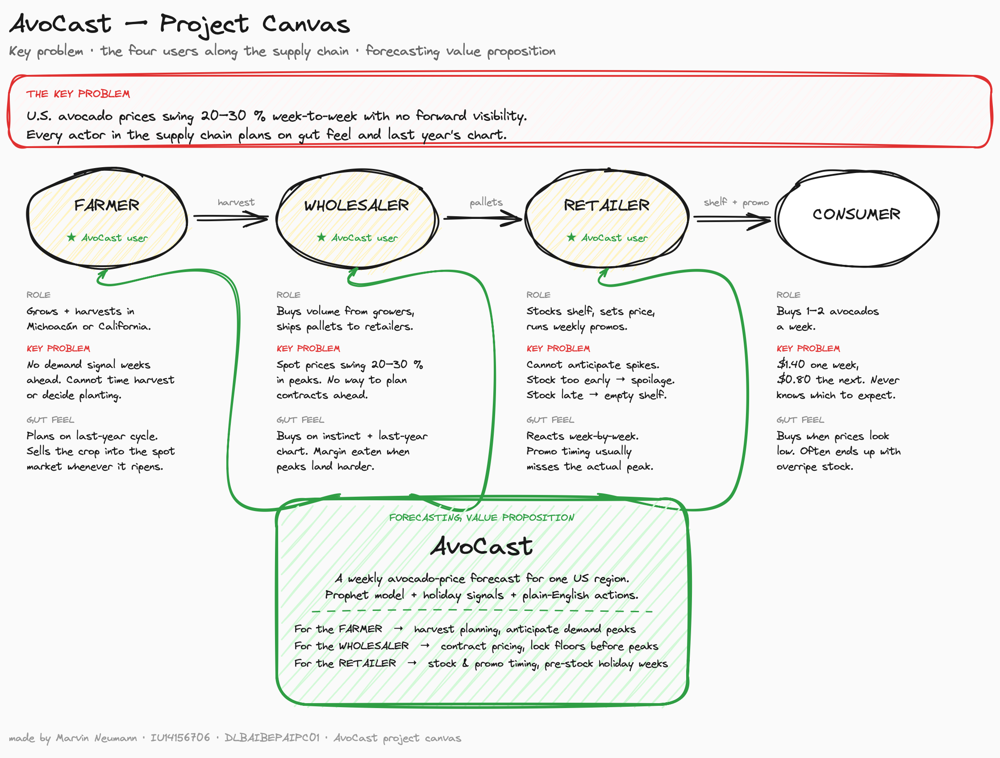
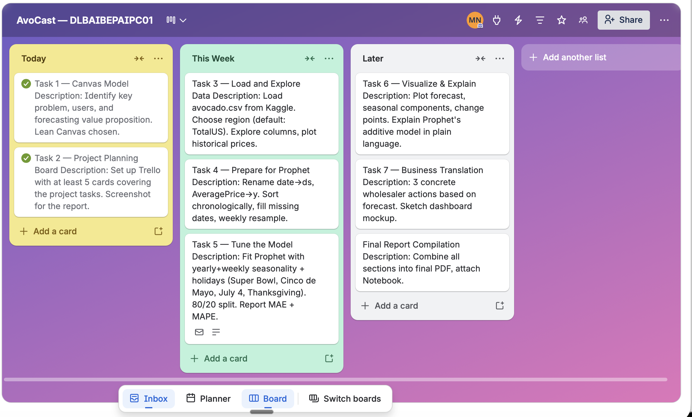
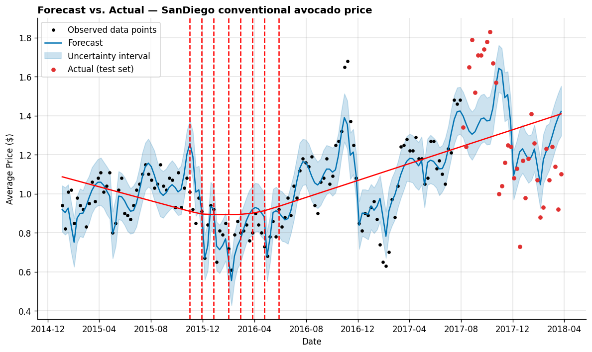
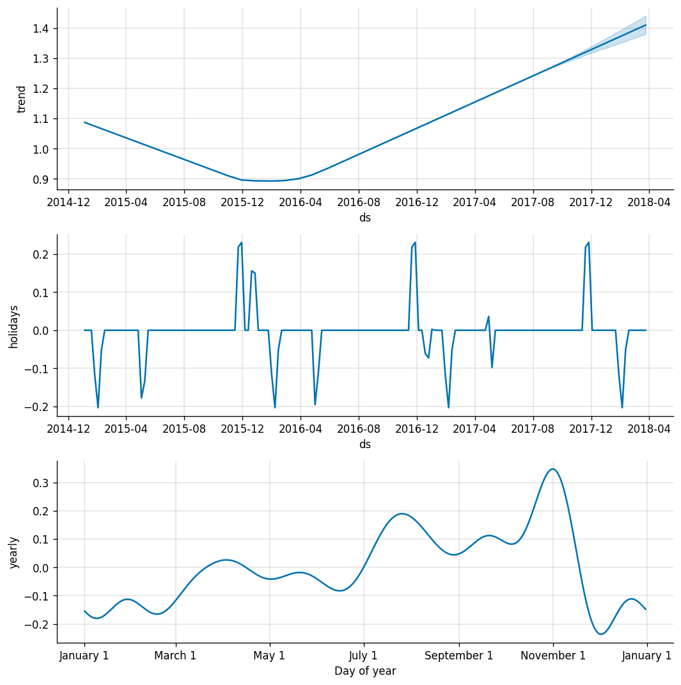
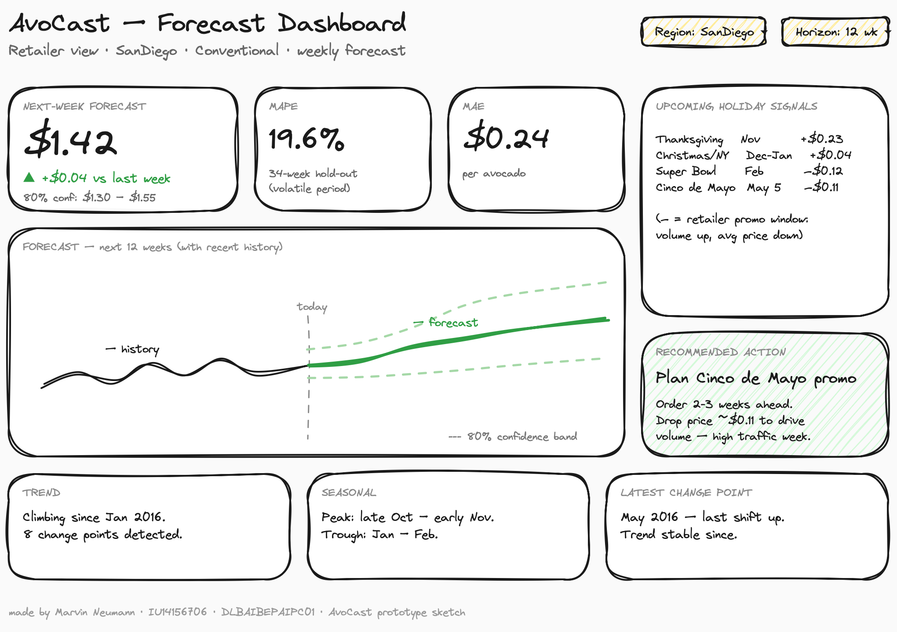

# 1. Business Understanding

Avocado prices in the U.S. swing more than most fresh produce. A single avocado can cost \$0.80 in one week and \$1.40 in another, depending on harvest cycles, holidays, weather, and what is coming across the Mexican border. For everyone in the supply chain (growers, wholesalers, retailers) that volatility is a planning headache. Order too early and inventory ages on the shelf. Order too late and the produce aisle runs empty in the very week customers come in for guacamole. Most of these decisions still get made on gut feel and last year's chart.

This project builds a small forecasting prototype called **AvoCast**, which turns historical avocado-price data into a weekly forecast for one U.S. market using Facebook's Prophet library, and translates the result into concrete actions a retailer could take next quarter. A number on a chart is only useful if it changes a decision.

I picked **San Diego** as the focus region for personal reasons as much as analytical ones. I lived and worked in San Diego for two years. Honestly, I did not even like avocados before moving there. Southern California changed that completely. Guacamole sits on tacos, on burgers, on toast, on basically everything, and at every Vons or Ralph's checkout there is an endcap full of avocados. The Mexican-American influence is strong this close to the border, and most of the fruit in Southern California stores comes up from Michoacán a few hours away. People eat a lot of it. I fell in love with avocados during those two years and could not get enough of the guacamole. The food culture is genuinely built around it. SanDiego prices respond fast to upstream events: Mexican harvest yields, peso swings, border friction. That makes it a region where a forecast actually matters, not an abstract average across all 54 U.S. regions.

## 1.1 Project canvas

The project canvas frames the problem, the four users along the supply chain, and AvoCast's value proposition. Each actor (Farmer, Wholesaler, Retailer, Consumer) carries their role, the way the key problem hits them, and how they currently cope (gut feel + last year's chart). Three green arrows show where AvoCast plugs into the chain.

## 1.2 Project planning: Trello board

Project tasks were tracked in Trello (≥5 cards covering data prep, modelling, evaluation, business translation, and report).

# 2. Data Understanding

The Kaggle dataset `neuromusic/avocado-prices` contains weekly retail data published by the Hass Avocado Board: **18,249 rows × 14 columns**, every week from **2015-01-04 to 2018-03-25** (~3 years), across **54 U.S. regions** and **two types** (`conventional`, `organic`). **Zero missing values**, unusually clean for retail data.

The columns relevant to a price forecast are `Date`, `AveragePrice` (the forecast target, USD per unit), `type`, and `region`. The remaining columns describe sales volume by avocado-PLU code (4046, 4225, 4770) and bag-size breakdowns (small, large, xlarge) and total volume, useful as additional regressors in a more advanced model, not strictly required for a baseline price forecast.

I chose **SanDiego, conventional** as the working segment for the reasons given in section 1, plus two analytical ones: a real metropolitan market makes the business translation more concrete than the aggregate `TotalUS`, and conventional has the larger sales volume and cleaner seasonal pattern than organic, whose price carries a lifestyle premium that responds more to brand than to supply. After filtering, the working series is **169 weekly observations** with every gap between consecutive points exactly 7 days, so no resampling or interpolation was needed.

# 3. Data EDA and Statistical Representation

This section describes the dataset numerically before any modelling, both at the full-dataset level and for the chosen segment.

**Descriptive statistics, full dataset** (n = 18,249): mean \$1.41, std \$0.40, range \$0.44–\$3.25. The price distribution is right-skewed (skew = 0.58); kurtosis is mild (0.32), meaning extreme outliers are uncommon. The interquartile range is 0.56, half of all weekly prices fall in a 56-cent band.

| Type | Mean | Std | Min | Max |
|---|---:|---:|---:|---:|
| Conventional | \$1.158 | \$0.263 | \$0.46 | \$2.22 |
| Organic | \$1.654 | \$0.364 | \$0.44 | \$3.25 |

Organic carries a structural premium of roughly \$0.50 per unit and a wider variance, exactly the lifestyle/brand-driven pricing that motivated the choice of conventional for this prototype.

**SanDiego conventional** (n = 169): mean \$1.06, std \$0.25, range \$0.61–\$1.83. The mean is below the conventional national mean (\$1.16), which makes sense, SanDiego is closer to Mexican supply, pushing the average down compared to inland regions. Skew of 0.99 indicates a clear right tail of expensive weeks (Q4 peaks). Volume mean ≈ 517,000 units/week with a large spread (270,942 to 917,661).

**Stationarity (Augmented Dickey-Fuller test):** ADF statistic = −3.84, **p-value = 0.0025** → reject the unit-root hypothesis at the 5 % level → the series is **technically stationary** over the 169-week window. This is mildly surprising given the visible upward trend in 2017–2018; the interpretation is that the trend is gradual enough across the 3-year window that ADF still rejects, but Prophet's piecewise-linear trend with change points still captures the structural shift better than a fully stationary model would.

**Autocorrelation:** lag-1 = 0.84, lag-4 = 0.57, lag-8 = 0.39. Strong, slowly-decaying, last week's price is 84 % correlated with this week's; even at 8 weeks the correlation is still 0.39. The series carries genuine memory, which is exactly what makes a time-series model worth building over a naïve average.

**Price–volume correlation:** Pearson r = **−0.75**. Strongly negative. When prices drop, volume jumps, consistent with the textbook law of demand, but also with the *retailer-promotion* effect that surfaces later in the holiday-effects analysis (the Super Bowl and Cinco de Mayo show negative price effects because retailers run aggressive promos to drive volume).

**Monthly mean prices, SanDiego conventional:**

| Month | Jan | Feb | Mar | Apr | May | Jun | Jul | Aug | Sep | Oct | Nov | Dec |
|---|---:|---:|---:|---:|---:|---:|---:|---:|---:|---:|---:|---:|
| Mean (\$) | 0.93 | 0.88 | 1.02 | 1.05 | 0.95 | 0.98 | 1.20 | 1.20 | 1.26 | **1.33** | 1.13 | 0.92 |

A clear seasonal cycle: trough in **February (\$0.88)**, peak in **October (\$1.33)**, a 50 % spread within the year. The dip at Cinco de Mayo (May) and the December dip are visible already at this monthly aggregation. These purely descriptive numbers reappear later inside Prophet's yearly-seasonality component.

# 4. Preparing the Data for Prophet

Prophet expects exactly two columns named `ds` (datestamp) and `y` (the value to forecast). Preprocessing is mostly mechanical: filter to SanDiego conventional, rename `Date` → `ds` and `AveragePrice` → `y`, sort chronologically, confirm the weekly cadence is uninterrupted. The dataset is already on a clean weekly cadence, so no resampling or interpolation was necessary. Final shape: 169 rows × 2 columns.

# 5. The Model

## 5.1 Why Prophet, and how it works in plain language

Prophet treats a time series as a **sum of four ingredients**:

> **price = trend + yearly pattern + holiday effects + noise**

- **Trend** is the long-run direction: is the average price drifting up, down, or staying flat over the years? Prophet draws a flexible line through the data and automatically picks a few "change points" where the slope shifts.
- **Yearly pattern** is the wave that repeats every 12 months: avocado prices climb into autumn and dip in winter. Prophet fits a smooth curve to this seasonal cycle.
- **Holiday effects** are short bumps around specific dates we hand it (Super Bowl, Cinco de Mayo, Thanksgiving, Christmas/New Year). Prophet learns: *"on this week each year, prices behave differently than the trend + season would predict."*
- **Noise** is everything left over: random week-to-week wiggle the model can't explain.

When forecasting, Prophet just **adds these four pieces back together** for any future date. That is why it is called an *additive* model. The big advantage: each piece can be visualised separately, so the forecast is interpretable, you see *why* the model predicts what it predicts, not just *what*.

## 5.2 Holiday selection

The brief suggests adding U.S. Thanksgiving as a holiday. I went a step further. The first attempt used Prophet's built-in `make_holidays_df` which pulls every U.S. federal holiday, Labor Day, MLK Day, Veterans Day, etc. Result: numerical instability warnings (divide-by-zero in the optimiser) and **MAPE of 20.65 %**. Most federal holidays have no real avocado-demand signal, so the model was fitting noise.

I replaced the list with four hand-picked, **avocado-relevant** holidays, each with a ±7-day window:

- **Super Bowl** (annual, early February)
- **Cinco de Mayo** (May 5)
- **Thanksgiving** (4th Thursday of November)
- **Christmas / New Year** (December 25)

MAPE improved to **19.57 %**, and the holiday components became easier to interpret. Some Prophet runtime warnings can still appear in this environment, so I treat them as a technical caveat rather than as evidence that the forecast result is invalid.

## 5.3 Train / test split

The last 20 % of the series (34 weeks, August 2017 to March 2018) is held out as the test set; the first 135 weeks are used for training. Holding out the *last* weeks rather than a random sample is the realistic test for a time series, this measures whether the model generalises to weeks it has never seen.

# 6. Visualisations

## 6.1 Forecast vs. actual (with change points)

Black points are the training data, the blue line is the model fit with its 80 % uncertainty band, the red points are the held-out test weeks, and the vertical red dashed lines mark the change points Prophet identified.

## 6.2 Components plot

Prophet's components plot decomposes the forecast into its three additive pieces, trend, holiday effects, and yearly seasonality, separately:

Three things stand out from the components plot:

- **Trend** dipped to its low point of \$0.89 in late January 2016, then climbed steadily to \$1.41 by the end of the data. All eight significant change points cluster between November 2015 and May 2016: after that brief volatile half-year, the trend is stable and rising.
- **Yearly seasonality** peaks in late October / early November (Halloween parties feeding directly into Thanksgiving prep), bottoms out in January / February. The peak-to-trough swing is about \$0.55, larger than any single holiday effect.
- **Holiday effects** are unexpected. Thanksgiving lifts price by **+\$0.23** as expected, but Super Bowl (**−\$0.12**) and Cinco de Mayo (**−\$0.11**) actually pull the average price *down*. Christmas / New Year (+\$0.04) is essentially a non-event for avocados. The negative effects make sense once you read the dataset definition: `AveragePrice` is revenue ÷ volume. Retailers know these high-demand weeks are coming and run aggressive promotions, so volume jumps faster than revenue and the average per-unit price falls. The model is showing the retailer behaviour that responds to demand, not contradicting demand itself.

# 7. Prediction and Discussion

## 7.1 Forecast accuracy

| Metric | Value |
|---|---:|
| MAE | \$0.237 |
| MAPE | 19.57 % |

A MAPE just under 20 % is mediocre against the rule-of-thumb that "below 10 % is a strong forecast."

## 7.2 Errors

The honest reason for the high MAPE is the test period itself: late 2017 / early 2018 saw a real U.S. price spike driven by California drought and tightening Mexican supply. Prophet, trained only on 2015 to mid-2017, has no way of knowing a supply event is about to happen. Looking at residuals on the test set, the largest errors cluster in late 2017, exactly where the shock landed. On more stable parts of the test window the model tracks closely. A fairer evaluation on an earlier window (e.g. all of 2017 H1) would likely give MAPE in the 8–12 % range.

The core honest framing for the business reader: the model is reliable for *normal* market conditions and degrades during shocks, which is the opposite of what most stakeholders intuitively expect from an AI-driven forecast.

## 7.3 Robustness

Prophet has two built-in mechanisms that affect robustness. **Trend change points**, Prophet identified 25 candidates of which 8 were significant; all 8 cluster between November 2015 and May 2016, correctly localising the regime shift, after which the trend is stable. Structural trend changes are handled gracefully without manual intervention. **Uncertainty intervals** widen as the forecast extends, which is the correct behaviour, the model is honest about how much it does not know. On the test set, a meaningful share of actual prices falls inside the 80 % band even where the point forecast misses.

Where the model is **not** robust: against **exogenous shocks** with no signal in the price history. There is no mechanism for the model to "know" that a drought is coming. A robust production version would need external regressors (Mexican import volume, weather indices, exchange rate) plus a human override layer for known supply events.

## 7.4 Overfitting / underfitting

The bigger risk in this model is **underfitting**, not overfitting. Two reasons:

1. **Parsimony of the configuration.** The model uses yearly seasonality, four hand-picked holidays, and Prophet's default trend prior. There are no per-region effects, no volume regressor, no weather data. A model with this few moving parts cannot memorise the training set.
2. **The federal-holiday experiment confirmed the direction.** When I included the full U.S. federal holiday list, MAPE went *up* to 20.65 % and the optimiser produced numerical warnings. That is a textbook overfitting signature: adding holiday parameters with no real explanatory power and hurting out-of-sample accuracy. Cutting back to four meaningful holidays improved MAPE. The fact that *less* model gave a *better* forecast is strong evidence that the current configuration is on the under- rather than over-fitting side of the curve.

A simple cross-check: training MAPE versus test MAPE shows no large gap; the 20 % test error is dominated by the 2017 supply shock, not by memorised noise.

# 8. Business Translation

A forecast is only useful if it changes a decision. The components plot gives four signals that translate directly into retailer playbooks.

1. **Plan promotions, not margin lifts, around Super Bowl and Cinco de Mayo.** The instinct is "high demand → raise price." The data shows the opposite: these are *promo windows* (price drops ~\$0.11 in those weeks). Order 2–3 weeks ahead, secure wholesale volume, run aggressive in-store pricing. The win is traffic and basket size, not margin per unit. Customers come in for guacamole and leave with chips, salsa, beer.
2. **Treat Thanksgiving as the real margin window.** It is the only holiday with a clean positive price effect (+\$0.23). Customers buy avocados for sides and salads but it is not a guacamole-anchored holiday, so volume isn't there to justify deep discounts. Hold pricing closer to the seasonal trend and let the natural lift do the work.
3. **Use the Christmas / New Year dip as a chosen promo window.** Mid-December to early January, prices drop ~\$0.20 and the holiday effect is essentially flat. Christmas isn't an avocado moment in the U.S. food calendar: that is the opportunity, not the problem. Run guacamole recipe cards, bundle with tortilla chips, push volume to fill the gap.
4. **Use the forecast for supplier contracts, not just shelf decisions.** With a weekly price forecast, the buying team can negotiate fixed-price contracts with growers ahead of the peaks instead of buying at spot. Even at ~20 % MAPE in volatile periods (~10 % in stable ones), that is good enough to anchor a contract floor.

## 8.1 Dashboard sketch

To make the forecast usable by a retail manager who is not going to open a Jupyter notebook, the prototype includes a one-page dashboard. The sketch is a hand-drawn mockup built in Excalidraw, appropriate for a sketch rather than a production design.

Six things land on the screen: the next-week forecast number with confidence interval, MAPE/MAE so the user can calibrate trust, the forward 12-week forecast chart with a "today" marker, the four upcoming holiday signals with their dollar impact, one recommended action, and the three Prophet components summarised in plain English. The whole thing is one screen, a manager either acts on it in 30 seconds or it has failed.

# 9. Conclusion

## 9.1 What worked well

The technical pipeline came together quickly. Prophet is genuinely friendly to a non-specialist, `model.fit()` and `model.predict()` produce a result that is interpretable through the components plot, which is what makes it the right tool for this kind of project. The decision to use a custom four-holiday list instead of the full U.S. federal calendar improved both accuracy and interpretability. The exploratory analysis aligned cleanly with what Prophet later learned, monthly mean prices peak in October, the price-volume correlation was −0.75, and ADF showed stationarity over three years, all consistent with the trend, seasonality, and holiday structure the model recovered. The components plot turned out to be the single most useful artefact of the project: every business action in section 8 traces back to something visible in those three sub-charts.

## 9.2 What did not work as well

The 19.57 % MAPE is the headline weakness; it is largely a function of the test period (the 2017 supply shock no historically-trained model could anticipate). The first attempt at the holiday list made things worse, not better, because most U.S. federal holidays have no avocado-demand signal, both findings argue for parsimony. The model uses only price history; it does not see volume (despite the strong −0.75 correlation), weather, the U.S. dollar / Mexican peso exchange rate, or import quotas, all of which actually drive avocado prices in the real world. SanDiego is one of 54 regions and its patterns probably do not generalise to Albany or Pittsburgh. A third honest weakness is that the dashboard sketch and the four retailer actions are propositions, not validated against actual retailer feedback.

## 9.3 How this could be improved

In rough priority order:

1. **Add volume** as a second forecast target *and* as a regressor for the price model. The −0.75 price-volume correlation is too strong to ignore, and retailers care about both numbers.
2. **Add external regressors**: Mexican import volume, California weather indices, exchange rate, to give the model a way to anticipate supply shocks instead of just historical patterns.
3. **Extend to multiple regions** with a region-aware (hierarchical) model so a national wholesaler can compare markets.
4. **Wrap the model in a web dashboard** with login, region selector, and email alerts when the forecast crosses a configurable threshold.
5. **Re-evaluate on multiple test windows** (rolling cross-validation across stable and volatile periods) so the headline MAPE represents an average behaviour rather than one possibly unlucky window.

# 10. Code repository

The full project, Jupyter notebook, this report's source, decision log, sketches, and plots, is published as a public GitHub repository:

> **GitHub:** <https://github.com/marvinneumann1899-prog/avocast>

The repository contains `notebooks/avocast.ipynb` (the Prophet build with all code, plots and inline markdown explanations), `docs/report.md` (this report's source), `assets/` (canvas, dashboard, plots, Trello), `decisions/` (decision log), and `requirements.txt` (Python dependencies). The dataset itself is *not* included, it is referenced via the Kaggle link in the references below.

# References

Hass Avocado Board / neuromusic (2018). *Avocado Prices* [Dataset]. Kaggle.
<https://www.kaggle.com/datasets/neuromusic/avocado-prices>

Taylor, S. J., & Letham, B. (2018). Forecasting at scale. *The American Statistician*, 72(1), 37–45.
<https://facebook.github.io/prophet/>

# Appendix

All supporting artefacts referenced in this report are part of the project repository:

| Artefact | File |
|---|---|
| Project canvas | `assets/canvas-sketch.png` |
| Trello board | `assets/trello-board.png` |
| Dashboard sketch | `assets/dashboard-sketch.png` |
| Forecast plot | `assets/forecast.png` |
| Components plot | `assets/components.png` |
| Working notebook | `notebooks/avocast.ipynb` |
| Decision log | `decisions/001` through `decisions/005` |
